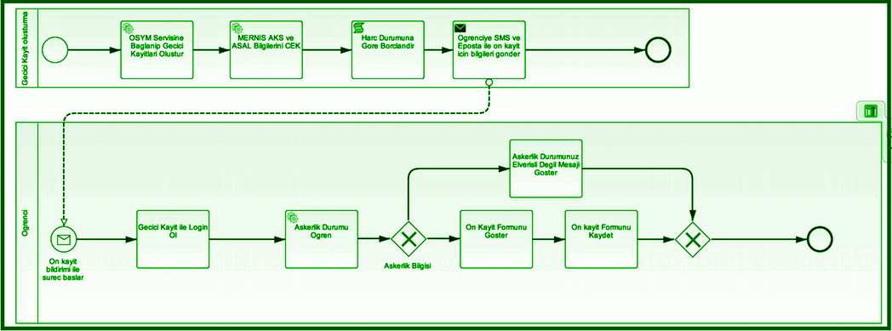
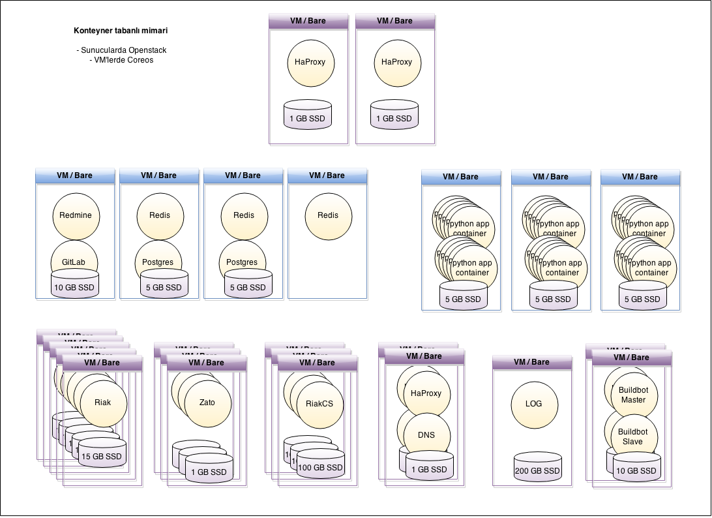
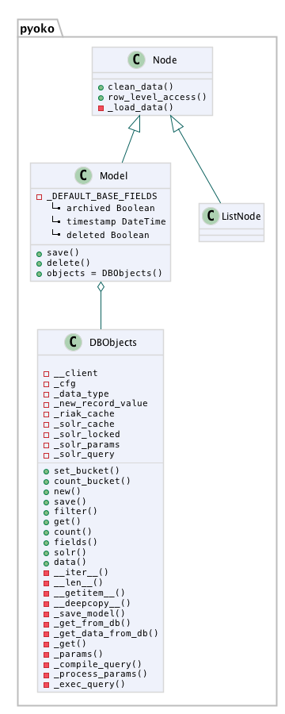
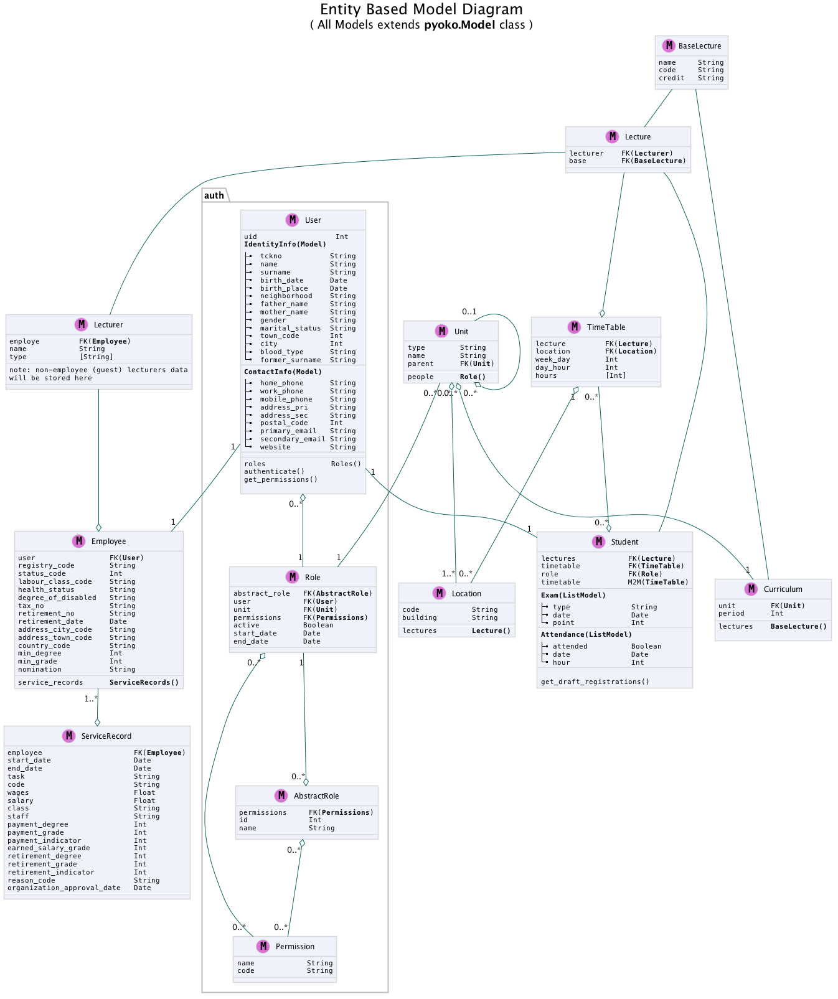
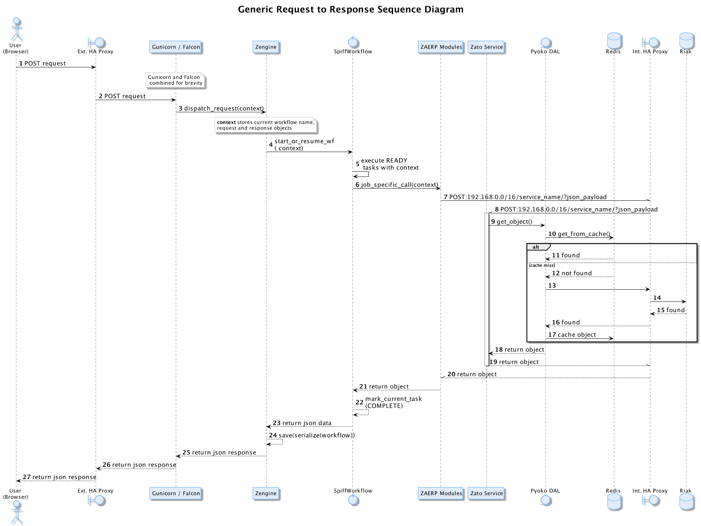
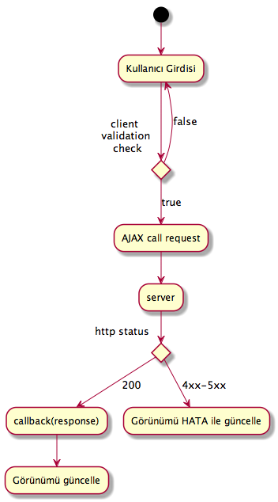

+++++++++++++++++++++++++++++++
Yazılım Tasarım Analizi Belgesi
+++++++++++++++++++++++++++++++

Sistem Mimarisi
%%%%%%%%%%%%%%%

İş Akışı (Workflow) Tabanlı Uyguluma
************************************
İş Akışı (Workflow) Tabanlı Uygulumalar, iş süreçlerini yeterince küçük adımlara bölerek, iş akışlarının aktörlerini ve her bir adımda işlenecek veriyi net bir şekilde tanımlayarak kolay yönetilebilirlik ve esneklik sağlarlar. İş süreçlerinin tamamıyla olmasa bile belli oranda otomatikleştirilmesi ve yazılım tarafından işlenebilir olması değişen ihtiyaçları karşılamak için kolaylık sağlamaktadır. Sadece iş akışı şemalarında yapılacak değişikliklerle uygulamaya yön vermek mümkündür.

**Örnek İş Akış Şeması**

İş süreçleri yönetimi için, BPMN2 kural setine uyan Workflow Management yapısı seçilmiştir.   Python dünyasında WorkFlow Management ve BPMN desteği bulunan SpiffWorkFlow kütüphanesi geliştirilmeye açık en uygun aday olduğu için seçilmiştir.

İş süreçlerinin görsel olarak oluşturulması için de Camunda Modeler seçilmiştir.

Kurumsal Veri Yolu Kullanımı
****************************
Kurumsal Veri Yolu (ESB) uygulamanın parçaları ve dış servisler arası iletişimi düzenler. Veri kaynaklarını mikro ölçekte, yeniden kullanılabilir servisler haline getirerek bir iletişim düzeni kurar. Özellikle dış servislerle veri alışverişini kendi üzerine alarak uygulama içerisinde daha sade ve yönetilebilir kod yazmaya olanak verir. Neden KVY gerektiği ile ilgili, tarafımızdan çevrilmiş bulunan, açıklayıcı ve detaylı yazıyı verilen bağlantıda [7]_ okuyabilirsiniz.

Sunucu ve Servis Yerleşimi
%%%%%%%%%%%%%%%%%%%%%%%%%%

VM Konfigürasyonları:
*********************
+-----------+------------+-------+----------------------------+
|Small:     | 2 GB RAM,  |2 VCPU |  2 GB Ephemeral SSD        |
|           |            |       |                            |
|Standart:  | 4 GB RAM,  |4 VCPU |   10 GB SSD                |
|           |            |       |                            |
|Large:     | 8 GB RAM,  |6 VCPU |                            |
+-----------+------------+-------+----------------------------+

\

\

+--------------+------------+---------+-----------------+----------+
| **Açıklama** |**VM Türü** |**Adet** |     **DİSK**    |  **OS**  |
+--------------+------------+---------+-----------------+----------+
|Riak Nodes    |  Large     |  5      |   400 GB SSD    | Coreos   |
+--------------+------------+---------+-----------------+----------+
|RiakCS        |  Standart  |  3      |   400 GB SSD    | Coreos   |
+--------------+------------+---------+-----------------+----------+
|Redis         |  Large     |  3      |   20 GB SSD     | Coreos   |
+--------------+------------+---------+-----------------+----------+
|Zato          |  Standart  |  3      |                 | Coreos   |
+--------------+------------+---------+-----------------+----------+
|HaProxy       |  Standart  |  2      |   1 GB NonSSD   | Coreos   |
+--------------+------------+---------+-----------------+----------+
|HaProxy       |  Large     |  2      |   10 GB SSD     | Coreos   |
+--------------+------------+---------+-----------------+----------+
|Logging       |  Standart  |  2      |   400 GB NonSSD | Coreos   |
+--------------+------------+---------+-----------------+----------+
|Apps          |  Small     |  3      |                 | Coreos   |
+--------------+------------+---------+-----------------+----------+
|Buildbot      |  Small     |  4      |   10 GB SSD     | Coreos   |
+--------------+------------+---------+-----------------+----------+
|Fab           |  Standart  |  1      |   40 GB SSD     | Ubuntu   |
+--------------+------------+---------+-----------------+----------+
|Sandbox       |  Standart  |  1      |   80 GB NonSSD  | Ubuntu   |
+--------------+------------+---------+-----------------+----------+

Image özellikleri:
******************
Coreos [8]_
Ubuntu [9]_

Tercih Edilen Yazılımlar
%%%%%%%%%%%%%%%%%%%%%%%%

Riak [10]_
**********
Riak, dağıtık bir veritabanı sistemidir. Verileri sunucular arasında dağıtarak yüksek erişilebilirliği sağlar. Riak’ın tercih edilmesindeki sebepler aşağıda sıralanmıştır:

- Çok kullanıcılı / çok rollü sistemde verilerin sürekli erişilebilir olması,

- Aynı veriye eş zamanlı erişerek okuma / yazma işlemlerinin, veriye erişimi bloke etmeyerek gerçekleştirilmesi,

- İş modeline uygun senaryolara göre ortaya çıkacak uyuşmazlıkların çözümlenebilmesine olanak vermesi,

- Zamanla büyüyen verinin sürekli yedekli olarak yönetilmesi,

- Veri tasarım şeklinin, RDBMS kalıpları dışında yapılabilmesi,
- Verinin “strong consistent” olarak tutulabilmesi sayesinde “ACID” benzeri bir tutarlılığa sahip olmak,

- Sistem tüm Türkiye çapında kullanılsa bile, değişik veri merkezlerinde “multi homed” olarak çalışabilir olması.

RiakCS [11]_
************
RiakCS, Riak veritabanı sisteminin üzerine kurulu nesne depolama (object storage) sistemidir. Sistemde kullanıcı tarafından üretilecek dokumanlar (resimler, doc, pdf vb) RiakCS ile saklanacaktır. RiakCS de dağıtık bir sistemdir. RiakCS ile yüksek erişilebilir, ölçeklenebilirlik dağıtık bir bulut depolama sistemi elde edilmiş olacaktır. RiakCS API (Uygulama Programlama Arayüzü) yaygın kullanılan Amazon S3 ile uyumludur.

Postgresql
**********
Postgresql, Zato Clusterı tarafından kullanılmaktadır. Cluster bilgileri gibi Zato’nun iç operasyonlarını ilgilendiren veriler saklanacaktır.

Redis [12]_
***********
Redis, bellekiçi key/value veritabanı sistemidir. Uygulama ile Riak arasında geçici depolama ve hızlı okuma işlemleri için kullanılacaktır. Bu sayede veritabanı üzerindeki yük hafifleyecek, veriye erişim çok yüksek hızlara çıkıp uygulama performası artacaktır.

Redis, ayrıca Zato tarafından benzer amaçlar için de kullanılacaktır.

Zato [13]_
**********
Zato Python ile geliştirilmiş Kurumsal Hizmet Veriyolu (Enterprise Service Bus) yazılımıdır. Zato ile iş akışlarına uygun olarak, uygulamalar arası veri trafiği, mikro servisler haline getirilerek düzenlenecektir. Zato sadece sistem içi operasyonlar için değil aynı zamanda dış kaynaklarla olan iletişimi de üzerine alıp onları sistemin içerden erişebileceği mikro servislere dönüştürecektir. Bu da dış dünya ile uygulamanın tıpkı içerdeki gibi benzer desenler ile konuşabilmesini sağlayarak tutarlılık sağlayacaktır.

HaProxy [14]_
*************
High Available (Yüksek Erişilebilirlik) Proxy, hem kullanıcı arayüzeyleri aracılığı ile gelecek istekler (requests), hem dışarıya açılan servislere yapılacak çağrılar, hem de sistem içi bileşenlerin birbirleri ile olan iletişimleri sonucu doğacak trafiği dengelemek ve yüksek erişilebilirliği sağlamak için kullanılacaktır.

Bulut araçları
%%%%%%%%%%%%%%

Docker [15]_
************
Docker uygulama ve servislerin konteynerlar şeklinde sanallaştırılarak Linux sistemleri üzerinde çalıştırılmasını sağlar. Docker uygulama ve servislerin yönetimini ve ölçeklenmesini kolaylaştrır. Bütün bileşenler kontenyerlar içinde servisler şeklinde çalışacaktır. Uygulama ve diğer tüm bileşenler bu sayede ihtiyaçlar ölçüsünde kolayca ölçeklenebilecektir.

Consul [16]_
************
Servislerin ve üzerlerinde çalıştıkları sistemlerin erişilebilirliği, yeni açılan veya herhangi bir sebeple çalışması kesintiye uğrayan, kapanan servislerden haberdar olmak için bütün host sistemlerde çalışacak servistir.

Systemd
*******
Systemd linux sistemler için neredeyse standart hale gelmiş modern servis yonetim aracıdır. Konteynerlar haline gelen uygulama parçacıkları systemd servisleri şeklinde yönetilecektir.

Etcd
****
Etcd bir sytemd servisi olarak çalışacak ve cluster çapında data alışverişi yapmak için kullanılacaktır. Ortam değişlenleri, değişen ayarlar, Consul ve benzeri servislerin haberleşmesi için kullanılacaktır.

Confd
*****
Confd başta haproxy gelmek üzere sistem servislerinin yeni durumlarına göre yeni ayar dosyaları üretme ve ilgili servisleri yeniden başlatma işini üstlenmektedir.

Flannel
*******
Flannel cluster içinde çalışan servisler (docker konteynerları) için özel bir ağ katmanı oluşturur.  Bu sayede servisler bu özel ağ üzerinden birbirleri ile konuşabilirler.
Fleet
*****
Fleet, konteyner haline getirilen servislerin cluster çapında systemd ye bildirilmesi ve yönetilmesinden sorumludur. Fleet yazılan bir servis için hazırlanan tanımlama dosyası (unit files) gereklerine uygun olarak, uygun gördüğü makinelerde çalıştırmaktan, bir başka makineye taşımaktan veya durdurmaktan sorumludur.
Github
******
Github [17]_ temel proje yönetim ve geliştirme alanımızdır. Birçok geliştiricinin alışık olduğu bu ortam, katkıcıların kolayca dahil olmalarına olanak vermektedir. Açık kaynaklı yazılım projeleri geliştirme teamüllerine uygun bir ortamdır. Git sürüm yönetim sistemini kullanmaktadır. Geliştirici ve kullanıcı topluluğun teknik tartışmaları, geri bildirimleri Github’ın sağladığı ilgii araçlarla yapılacaktır.

Continuous Integration  & Continuous Delivery
*********************************************
Uygulama kaynak kodu ve/veya sistem/ortam ayarları değişiklikleri üzerine, uygulamanın test edilmesi, belirlenen ortamlarda kurulum ve yayınlanma işlerinin otomatik şekilde yapılması, elde edilen sonuçların geliştiricilerle paylaşılması ve raporlanması, geliştirme süreçlerini kolaylaştırmakta, hızlandırmakta, problemlerin kaynaklarını tespit etmeye yardımcı olmaktadır.

Projede, bu amaçla Buildbot [18]_ kullanılacaktır. Buildbot ile üretilen her türlü sonuç, log, rapor projede ilgili taraflara çeşitli kanallardan iletilecektir.

Logging
%%%%%%%

Kayıt Türleri
*************
**DEBUG:** Geliştici ve sistem yöneticileri için, servis veya uygulamaların çalışmaları hakkında açıklayıcı bilgiler sunar. Bu bilgiler geliştirme evresinde ve sorun çözme aşamalarında kullanılır.

**INFO:** Servis veya uygulamaların önemli adımlarının sonuçlarına, durum değişikliklerine ilişkin detaylı bilgiler içerir. Kullanıcı giriş yaptı, yeni ders eklendi, servis yeniden başladı vb..

**WARN:** Servis veya uygulamaların beklenen dışında davranışlar göstermesi hakkında bilgiler içeren kayıtlardır. Hata olmamakla birlikte bir servise erişememek, diske yazamamak gibi geçici problemlerin sebep olduğu aksaklıkların bildirilmesini kapsar. Uygulama veya servis kesintiye uğramaz fakat nasıl yönlendirildiğine bağlı olarak bir süre sonra yeniden deneyebilir, raporlayabilir, başka bir yöne doğru ilerleyebilir.

**ERROR:** Uygulamanın bir adımında beklenen işlevi yerine getirememesi sonucu ortaya çıkan kayıtlardır. Servis veya uygulama kesintiye uğramaz fakat ilgili adım muhtemelen elle müdahale gerektirecek bir problemle karşı karşıyadır.

**FATAL:** Uygulama yada servisin, veri kaybına da neden olabilecek bir hizmet kesintisine uğraması durumunda tutulan kayıtlardır.

Log Yönetimi
************
Hem uygulama hem de uygulamanın çalışacağı ortam bileşenlerinin her birinden toplanacak loglar, merkezi bir loglama sisteminde toplanacaktır. Sistemin anlık olarak izlenmesi, olağandışı gelişmelere uygun aksiyonlar alınması, uzun vadede geliştirme süreçlerine geribildirim olarak dönmesi amacıyla toplanan kayıtlar analiz edilecektir.

Bu amaçla Logstash [19]_ , Kibana [20]_, Elasticsearch [21]_ üçlüsü kullanılacaktır. Logstash ve Elasticsearch logların toplanması, filtrelenmesi, analiz edilmesi, Kibana ise görselleştirilmesi için kullanılacaktır.

Sistem ve Servis Logları
************************
Uygulamanın üzerinde çalışacağı donanım, işletim sistemi, cluster ve bunlar üzerinde çalışacak servisler hakkında şu loglar tutulacaktır:

- Coreos ve sanallaştırma araçlarından elde edilen loglar,

- Sisteme yapılan girişler,

- Açılan kapanan konteynerların durumları hakkındaki loglar,

- Konteyner haline gelmiş servislerden

 + Load Balancer erişim, hata, health check logları

 + Riak ve RiakCS cluster yönetimi, riak admin logları

 + Riak ve RiakCS kimlik dogrulama ve yetkilendirme logları

 + Zato servis hata logları

 + Zato iç ve dış servisler için doğrulama ve yetkilendirme logları

Sistem ve Servis Log Analizi
****************************
- Çalışması duran servislerin tespit edilmesi ve aksiyon alınması,

- Servislerden gelen hata loglarının, bellek durumu, cpu yükleri, disk doluluğu, network problemleri gibi donanım ve ağ logları ile birleştirilerek, aralarında bir kolerasyon olup olmadığının anlaşılması,

- Servislerin durmasından hemen önceki işlemlerin tür ve yoğunluğunun önceki servis durmaları ile ortaklık gösterip göstermediğine bakılarak, örneğin disk i/o, vtye belirli sayıların üzerinde yazma vb gibi işlemlerin servislere olan olumsuz etkilerin ve buna yol açan sebeplerin anlaşılması,

- Clustered servislerden gelen loglara bakarak yük dağıtımının dengeli bir şekilde yapılıp yapılmadığının anlaşılması,

- Consul ile birlikte monitoringe yardımcı olması

Kullanıcı Arayüzü Logları
*************************
Kullanıcı arayüzünde oluşacak çalışma zamanı hataları tarayıcı konsoluna düşmektedir. Bu loglar yakalanarak sunucu tarafındaki log tutucuya gönderilerek kaydedilecektir.

Arayüz fonksiyonları logları belirtilen log seviyelerinde tutulacaktır..

Prod başlığında belirtilen maddeler ışığında arayüz logları için stacktrace.js kullanılacaktır.

**incele:**

http://logstash.net/docs/1.1.1/outputs/riak#setting_bucket

http://underthehood.meltwater.com/blog/2015/04/14/riak-elasticsearch-and-numad-walk-into-a-red-hat/

**Notlar:**

CEP için loglarla nasıl bir relation kuracağız? Loglardan event trigger etmek nasıl?

**Refleksler:**

- Duran servisleri yeniden başlatmak

- Ölenlerin yerine yenisini başlatmak

- Ağır yük altında olan servisleri genişletmek

- Hafif yük altında olan servisleri daraltmak

- Ölçeklenecek serviler için sistem kaynaklarının yetersizliğini tespit edip yeni kaynaklar eklemek veya kaynak ihtiyacını bildirmek. Mümkünse clustera yeni nodelar
otomatik eklemek.

- Kronik hale gelen problemlerin tespiti ve bilgilendirilmesi. Muhtemel konfigurasyon problemleri demek.

- Application loglarindan gelen uyarilar

Fleet API kullanarak clusterda tanımlı servisleri başlatmak / durdurmak mümkün. Node ekleyip çıkarmak için Openstack / GCE API ile konuşmamız gerekir. Notification eposta veya sms ile mümkün. Yukarıdakilere ek başka ne gibi aksiyonlar olabilir?

Tercih Edilen Yazılım Bileşenleri
%%%%%%%%%%%%%%%%%%%%%%%%%%%%%%%%%

Arka Uçta Kullanılan Bileşenler
*******************************

Genel Sistem Akış Şeması
------------------------
.. image:: _static/genelsistemakssemas.png
   :scale: 70 %
   :align: center

Modül / Bileşenlerin Genel Görünümü
-----------------------------------
- zaerp

    -zdispatch

requestleri karsilayip ilgili is akislarina yonlendiren falcon web çatısı dosyalari yer alacaktir

    -bin

çalıştırılabilir uygulamalar. örn: bpmn packager.

	-lib

yardımcı kütüphane ve fonksiyon setleri

	-modules

bazıları kendi alt dizinlerine sahip olan uygulama modulleri.

	-auth

örnek authentication modülü

	-models

		%user.py

		%auth.py

		%employee.py

		%unit.py

	-services

bu dizinde Zato mikro servis dosyaları yer alacaktır.

	-workflows

bu dizinde iş akışı paketleri bpmn dosyaları yer alacaktır

- tests

methodlar, uygulama birimleri ve uygulama geneli icin yazilan unit testleri yer alacaktır

- docs

	-geliştiriciler

		%diagrams

		%api

	-son kullanıcılar

	-sistem yöneticileri

kod, api, kullanici, gelistirici, sistem yoneticisi dokumanlari yer alacaktir.

Uygulamanın veri ve iş mantığının şu ana kadar planlanan yapısını gösteren class diagramlar aşağıda görülebilir.

.. image:: _static/spiffworkflow.png
   :scale: 70 %
   :align: center

SpiffWorkflow Engine
********************
BPMN 2.0 notasyonunun önemli bir kısmını destekleyen, Python ile yazılmış bir iş akış motoru (workflow engine) uygulaması olan SpiffWorkflow incelenmiştir. Mevcut haliyle, tüm ihtiyaçlara cevap veremeyeceği tespit edildiğinden, ZetaOps tarafından genişletilerek yazılmaya devam edilmektedir. Genişletilmiş hali ile bu kütüphane tüm uygulamanın hareket zeminini oluşturmaktadır.

Zetaops sürümü olan kütüphane ile, uygulama iş mantığının anahatları BPMN 2.0 notasyonuna uyumlu XML diagramlarından okunarak işletilecektir. Öğrencilerin sisteme giriş yapmasından arka planda çalışacak zamanlanmış görevlerin işletilmesine kadar tüm iş akışları, bu iş akış motoru tarafından yönetilecektir.

Pyoko
*****
Riak veri şemalarının Python nesneleri olarak modellenmesi, bu modeller arasında bağlantılar tanımlanabilmesi, verilerin kayıt sırasında şema tanımlarına göre doğrulanması, kayıtlı verilerin pratik bir API ile sorgulanabilmesi ve geliştirme süresince bu şemalarda yapılacak değişikliklerin sürümlendirilerek saklanabilmesiamacıyla arka uçta Riak ve Redis’i kullanan Pyoko kütüphanesi ZetaOps tarafından geliştirilmektedir.

ZEngine
*******
ZetaOps tarafından geliştirilmekte olan ZEngine, SpiffWorkflow’u taban alan basit bir web çatısıdır. Bu yapıda önyüze yönelik her iş akışının bir URLsi olmakta ve o anda işletilmekte olan iş akışı adımında referans verilen uygulama nesnesi (view class) request ve response nesneleri ile çağırılmaktadır.

Kural Motoru (Rule Engine)
**************************
Uygulamanın, kanun ve yönetmelik değişikliklerine bağlı olarak zamanla değişebilecek tanım ve kurallara dayalı iş mantığı, merkezi bir depodan kolayca güncellenebilecek ve sistem yöneticileri tarafından düzenlenebilecek kural setleri ile tanımlanacaktır.

Zato Servisleri
***************
SOAP, REST, JSON, XML, CSV, PB gibi farklı protokol ve veri tipleriyle konuşan servislerin dönüşümü Zato ESB üzerinde yapılacaktır. Harici istemciler ve farklı modüller tarafından ihtiyaç duyulan işlevsellikler Zato ESB üzerinde çalışan mikro servisler olarak sunulacaktır. Uygulamanın hizmet sağlayıcı olduğu her durumda REST stili kullanılacaktır.

Falcon WSGI Framework
*********************
Çok hafif ve hızlı bir web çatısı olan Falcon, WSGI sunucusundan gelen requestleri Zengine’e aktarmak için kullanılacaktır. Kullanıcı oturumları tarayıcı çerezleri ve Redis tabanlı olarak bu katmanda yönetilecektir.

Gunicorn WSGI Server
********************
Gunicorn, Python tabanlı, WSGI uyumlu az sistem kaynağı tüketen hızlı bir web sunucusudur.

Raporlama ve Analiz
*******************
Önceden oluşturulan standart raporlara ek olarak, indekslenmiş veri üzerinde gelişmiş sorgulamalar yaparak her türlü günlük ihtiyaca yanıt verebilecek esnek bir raporlama altyapısı geliştirilecektir. Verilerin çok çeşitli şekillerde incelenmesine ve derlenmesine olanak veren Python tabanlı analiz betiklerine ek olarak, indekslenmemiş büyük miktarda veri üzerinde MapReduce işlemleri yapabilmek için Erlang betikleri de kullanılabilecektir.

Kullanıcı Arayüz Bileşenleri
****************************
	- Angular.js

AngularJS, MVC (Model View Controller) deseni sağlayan bir javascript uygulama çatısıdır. Kullanıcı arayüzü işlemlerini gerçekleştirecek tüm fonksiyonlar için kullanılır.  AngularJS standart sunucu taraflı yazılım geliştirme tekniklerini önyüze uygulayan ve önyüz geliştirmeyi hızlandıran bir uygulama çatısıdır. Karmaşık uygulamalarda DOM yönetimini başarıyla gerçekleştirir ve bu sayede uygulamanın kesintisiz ve sorunsuz çalışmasını sağlar.

        - Karma

Karma, Uygulama fonksiyonları için yazılmış testleri uygulayan test sürücüsüdür. Uygulamamızda Jasmine test çatısı testlerinin çalıştırılmasında kullanılır. Geliştiricinin her bir test ortamı için ayrı ayrı yapılandırma dosyası oluşturmadan tek bir yapılandırma ile testleri çalıştırabilmesini sağlar.

	- Selenium

Selenium, E2E testlerin çalıştırıldığı test platformudur. Kullanıcının tarayıcıda gerçekleştireceği işlemlerin sunucudan dönecek sonuca kadar test edilmesini sağlar.

        - Protractor

Protractor Selenium E2E testleri için bir çözüm enteratörü uygulama çatısıdır. Angularjs için Selenium özelleştirmeleriyle daha etkin ve bekleme sürelerini optimize ederek daha kısa sürede test edilmesini sağlar.

	- Jasmine

Jasmine, javascript testleri için kullanılan bir uygulama çatısıdır. Uygulama fonksiyonlarının testlerinde başarılı sentaksı ile geliştirme sürecini hızlandırır.

	- Bower

Bower, uygulamada kullanılacak paketlerin yönetimi için kullandığımız paket yönetim aracıdır. Uygulamanın gerektirdiği paketlerin kurulum esnasında eksiksiz şekilde ve sürüm uyumlu olarak kurulumunu sağlar.

	- Grunt

Grunt javascript uygulamaları için bir görev yürütücüsüdür. Küçültme, derleme, paketleme, testler gibi tekrarlanan görevleri otomasyon ile yürütmek için kullanılır.

	- Nodejs

Nodejs javascript uygulamaları için sunucu taraflı çalışma zamanı ortamıdır (runtime environment). Uygulama geliştirilirken bower, jasmine, karma gibi araçların kullanılması için gereklidir.
StackTrace.js

     - npm

npm nodejs için paket yönetim aracıdır. Uygulamanın geliştirme ortamı için gerekliliklerinin yönetilmesini sağlar.

     - Bootstrap3

Bootstrap3 grid sistem standardına uygun uyumlu (responsive) arayüz geliştirmek için kullanılan html, css vs javascript uygulama çatısıdır. Uygulamanın değişik ekran boyutlarında ve farklı cihazlarda sorunsuz çalışması için kullanılır.

Kullanıcı arayüz tasarımında uyulacak kurallar ve ilkeler
---------------------------------------------------------
	- Tüm tasarım bileşenleri html5 standardına uyacaktır.

	- Tasarım, kullanıcı arayüzü temiz ve tutarlı modeller temel alınarak anlamlı, kullanışlı ve amaca hizmet edecek şekilde organize etmelidir.

	- Basit ve sık yapılan işlemleri kolayca gerçekleştirebilmeli, kullanıcıyla açık ve kolay iletişim kurabilmeli, uzun işlemler için kullanışlı kısayollar sağlamalıdır.

	- Kullanıcı arayüzü tasarımı, yapılacak işlemler için tüm ihtiyaç duyulan opsiyonları ve materyalleri kullanıcının dikkatini dağıtmadan ve tam şekilde verebilmelidir.

	- Tasarım kullanıcıyı değişiklikler halinde bilgilendirmeli, kullanım esnasında oluşacak hataları kullanıcının anlayacağı şekilde sunabilmelidir.

	- Tasarım bileşenleri tekrar kullanılabilir olmalıdır.

	- Tasarım tüm ekran çözünürlüklerinde düzgün çalışabilmelidir.

	- Tasarım özürlü [22]_ kullanıcılar için “mümkün” olduğu kadar kolay bir kullanım sunabilmelidir.

Kullanıcı veri girişi ilkeleri
------------------------------
	- Kullanıcı verileri güvenli şekilde ve amaca yönelik geçerlilik kuralları çerçevesinde girilebilmelidir.

	- Kullanıcı daha az vuruş kullanarak kısa sürede veri girebilmelidir. Bunun için otomatik tamamlayıcılar, açılır menüler gibi kolaylaştırıcı bileşenler kullanılmalıdır.

Arayüz tasarımı ilkeleri
************************

	- Arayüz farklı amaçlar için kullanılacak farklı bölümlerden oluşmalıdır.

	- Kullanıcı her zaman sistemde nerede olduğunu ve hangi bilgilerin ona gösterildiğini bilmelidir.

	- Arayüz kolay kullanımlı ve estetik olmalıdır.

	- Arayüzün kullanımı kolay öğrenilebilmelidir.

	- Arayüz kullanıcının minimum eforuyla çalışabilmelidir.

Hata mesajları, uyarılar ve gösterilecek diğer bilgi ilkeleri
*************************************************************

    - Kullanıcı hatalar hakkında anlaşılır şekilde bilgilendirilmelidir.

    - Uyarılar kullanıcının etkileşimini kesintiye uğratmayacak şekilde gösterilmelidir.

    - Tekrar eden durumlarda kullanıcı deneyimini kesintiye uğratmamalı ve tekrarlı hatalar farkedilerek ona göre gösterilmelidir.

    - Kullanıcının yapacağı işlemle alakasız bilgiler arayüzde yer almamalıdır.

Modül Yapısı ve Klasör Hiyerarşisi
**********************************
**app/**
       Uygulamanın yer aldığı dizindir.

**bower_components/**
       Bower paket yönetimi ile uygulama kullanılan harici paketlerin tutulduğu dizindir.

**components/**
       Uygulama ortak bileşenlerinin bulunduğu dizindir.

**dashboard/**
       Yönetim paneli teması, controller, view ve testlerinin bulunduğu dizindir. her bir modül için benzer bir dizin buunacaktır.
		+dashboard.html
		+dashboard.js
		+dashboard_test.js

**app.css/**
       Uygulama genel css dosyası

**app.js/**
       Uygulama ana javascript dosyası

**index.html/**

**e2e-tests/**

**protractor.conf.js/**
       E2E testlerinin yapılandırıldığı dosyadır. E2E testleri için protractor kullanılmaktadır.

**scenarios.js/**
       E2E test senaryolarının yazılı olduğu dosyadır.

**node_modules/**
       Uygulamada kullanılan nodejs modüllerinin yer aldığı dizindir.

**bower.json/**
       Uygulama bağımlılıklarının yapılandırıldığı dosyadır.

**karma.conf.js/**
       Karma testleri için yapılandırma dosyasıdır.

**package.json/**
       Uygulama nodejs bağımlılıklarının yapılandırıldığı dosyadır.

Ekran Listesi
*************
Uygulamada belirlenen yetkilendirme şemasına göre, yetkili olan kişinin bir ya da daha çok kontrol paneli (dashboard) olabilir. Her bir ekran görünümü belirli parçalardan oluşacaktır. Giriş talebi yapıldığında yetki türüne göre kullanıcının ekranı bileşenleri bir araya getirilerek uygun hale getirilir (render) ve gösterilir. Sistemin kullanacağı ortak bileşenler birer Angular [23]_ modülü olacaktır.

Navigasyon Diagramı
*******************
Üniversite web uygulaması ve katmanlarını içerir.

.. image:: _static/webappkatmanlar.png
   :scale: 100 %
   :align: center

Çevrimiçi Yardım ve Rehberler
*****************************

Kullanıcıların arayüzü kolayca öğrenebilmelerini sağlamak ve kullanım esnasında karşılaşacakları sorunlar sırasında yardım etmek amacıyla çevrimiçi yardım ve rehber araçları kullanılır.

Sisteme ilk kez giriş yapan kullanıcıyı yönlendirmek ve arayüzün işlevleri hakkında bilgilendirmek amacıyla rehber araçları kullanılır.

Kullanıcı sistemin bir noktasında sorunla karşılaştığında bağlamsal olarak derhal konuyla ilgili yardıma erişmesi için çevrimiçi yardım araçları kullanılır.

**Şekil: Kullanıcı Formları Request/Response Cycle Talep/Cevap Yaşam Döngüsü**

**Şekil: Kullanıcı Arayüz Bileşenleri  Request/Response Cycle Talep/Cevap Yaşam Döngüsü**

.. image:: _static/kullancform2.png
   :scale: 100 %
   :align: center

Veri Tasarımı
%%%%%%%%%%%%%

Geçici Veri
***********
Uygulamanın sık kullandığı veriler Redis üzerinde önbelleklenecektir. Bu önbellek verileri işlemci ve veritabanı yükü açısından pahalı işlemlerle hesaplanmış değerleri ve veritabanından sık sık okunan verileri  içerir. Pyoko kütüphanesi üzerinden yapılan doğrudan veri çağrıları (get request) otomatik olarak önbellekleneren veri tabanı üzerindeki sorgu yükü hafifletilecektir.

Önbellekleme haricinde, kullanıcı oturumları da Redis üzerinde tutulacaktır. Kullanıcının o an geçerli yetkileri, oturum boyunca yaptığı işlemlerle ilgili durum bilgileri de yine kullanıcı oturumu içerisinde tutulacaktır.

Kalıcı Veri
***********
Verilerin kalıcı olarak saklanacağı Riak, basit anahtar-değer çiftlerinden map, set, counter gibi gelişmiş veri tiplerine, nihayetinde tutarlılıktan (eventually consistent) kesin tutarlılığa (strong consistency) kadar çeşitli veri saklama kiplerini destekleyen gelişmiş bir NoSQL veri tabanıdır.
JSON biçiminde saklanacak olan veriler, Riak’ın dahili Apache Solr entegrasyonunu sayesinde istenilen incelikte indekslenmekte ver sorgulanabilmektedir.

Kalıcı olarak depolanacak tüm veri sürümlendirilerek saklanacaktır. Bu sayede her hangi bir kaydın son 100 sürümü ya da son 10 yıl içindeki tüm sürümlerine istenildiği an ulaşılabilecektir.
Sürüm sayısına ya da süreye göre ne kadar geriye dönük saklama yapılacağı her bucket için kendi model tanımı altında yapılacaktır.

Veritabanı seviyesinde herhangi bir şablon kısıtı olmamasına rağmen, veriyi tutarlı biçimde saklayabilmek ve hızlı bir şekilde sorgulayarak erişebilmek için tüm veriler iç içe Python sınıfları şeklinde modellenecek, bu modeller kayıt esnasında JSON şeklinde biçimlendirilerek saklanacak ve yine modelde tanımlandığı şekilde indekslenecektir.

Test ve Prod ortamları için farklı bucketlar kullanılacak, değişen konfigurasyon ve yük testleri için geçici Riak clusterları açılacaktır.

Veri ve Veri Şablonu Göçü
-------------------------
Uygulamanın yaşamı boyunca veri şablonlarında yapılacak güncellemeler ve bu güncellemeler nedeniyle verinin kendisinde yapılması gerekecek veri göçleri Pyoko kütüphanesi ile sürümlendirilecek ve yönetilecektir. Uygulamayı bir üst sürüme güncellemek ya da önceki sürüme dönmek için gerekli veri tabanı işlemlerini içeren göç betikleri geliştirme aşamasında Pyoko yardımıyla türetilecek ve kod deposuna eklenecektir. Gerektiğinde, elle özel göç betikleride yazılacaktır.

Varlıklar (Entities)
********************
Uygulama içinden çağrılan tüm veri adları İngilizce olacaktır. Her bir entity için ayrıca bu belgeye ek belgeler oluşturulacaktır.

- Personel

- Student

- Program

- Lecture

- Unit

Dış Veri Kaynakları
*******************
Sistem birçok veri kaynağı ile konuşabilecek, ihtiyaç duyulan veri alışverişini sağlayacaktır. Bu dış kaynakların biçemleri XML, JSON şeklinde değişik olabilir. Konuşulacak servislerin detayları aşağıdaki gibidir.

LDAP
----
Birçok üniversitede doğrulama ve yetkilendirme gibi amaçlar için aktif şekilde kullanılan LDAP sistem tarafından desteklenecektir. LDAP’ta yapılan değişiklikler sisteme düzenli şekilde yansıtılacak, sistem gerektiğinde LDAP şemalarında değişiklik yapabilecektir. Özellikle göç aşamaları gibi LDAP kullanımının kaçınılmaz olduğu zaman ve şartlar için öngörüşmüştür.

KBS
----
Kamu Harcama ve Muhasebe Bilişim Sistemi (KBS) Maliye Bakanlığı tarafından sağlanan, kamu kurumlarında tahakkuk ve ödeme işlemlerinin otomasyonunu sağlayan bir edevlet uygulamasıdır. Üniversitelerde de birçok mali işlem KBS aracılığıyla gerçekleştirilmektedir. KBS sisteminin el verdiği ölçüde entegrasyon sağlanacaktır.

HİTAP
-----
HİTAP(Hizmet Takip Projesi), devlet memurlarının hizmetlerinin takibi amacıyla Sosyal Güvenlik Kurumu tarafından geliştirilmiş edevlet uygulamasıdır. Personel bilgilerinin iki yönlü güncellenmesi için HİTAP servisi ile düzenli şekilde veri alışverişi yapılacaktır. HİTAP bir SOAP servisidir.

ASAL
----
ASAL Servisi, Milli Savunma Bakanlığı tarafından sağlanan yurttaşların askerlik durumlarını sorgulayabildikleri  bir edevlet uygulamasıdır. Bu uygulama ile web servisi şeklinde konuşup, erkek öğrenci ve personin askerlik durumları karşılıklı olarak takip edilecektir.

ÖSYM
----
Öğrenci kayıtlarının otomatizasyonuna yardımcı olmak için, yerleştirme bilgileri ÖSYM’nin sunduğu

YÖKSİS
------
YÖKSİS (Yükseköğretim Bilgi Sistemi) YÖK tarafından kurulan yükseköğretim kurumlarının çeşitli bilgilerinin merkezi şekilde saklandığı sistemdir. YÖK üniversitelerden YÖKSİS’e düzenli veri girişi beklemektedir. Ayrıca YÖK üniversitelerde açılan bölüm ve programların bilgilerinde çeşitli güncellemeler yapmakta, bu güncellemelerin verinin bütünlüğü ve tutarlılığı için en kısa sürede üniversitelerin sistemlerine aktarılması gerekmektedir. YÖKSİS entegrasyonu bu ihtiyaç ve sorunlara çözüm olacaktır. YÖKSİS bir SOAP servisidir.

AKS
----
Adres Kayıt Sistemi, Nüfus ve Vatandaşlık İşleri tarafından sağlanan bir edevlet hizmetidir. Sistemimiz bu hizmet ile tam entegrasyon halinde olacak ve sisteme kayıtlı kişilerin adres bilgilerini bu sistemdeki kayıtlar ile güncelleyecektir.

MERNİS
------
AKS gibi merkezi kimlik hizmetidir. Sistemde kayıtlı kişilerin kimlik bilgileri MERNİS ile uyumlu şekilde saklanacaktır.

BANKALAR
--------
Öğrenci Harç ve ödeme işlemlerinin takip edilmesi için bankaya açılacak olan servistir. Banka öğrencilerin ödemeleri gereken miktarları bu servis aracılığı ile öğrenir ve ödeme bilgilerini sisteme geri bildirir. Bizim tarafımızda açılacak servis REST türünde olacaktır.

SMS
----
Öğrenci ve personele SMS bildirimleri yapmak isteyecek öğrenciler üniversiteler kendi servislerini Zato ESB ile kolayca yazabileceklerdir.

Rol ve Yetki Kontrolü (ACL - Access Control List)
%%%%%%%%%%%%%%%%%%%%%%%%%%%%%%%%%%%%%%%%%%%%%%%%%

Rol ve Öznitelik tabanlı hibrid bir yetkilendirme ve veri erişim kontrol modeli kullanılacaktır. Kurgulanacak sistem, Midpoint IDM gibi kimlik yönetimi sistemleri ile dış kimlik kaynaklarıyla (LDAP, veritabanları) REST metoduyla veri alışverişi yapabilecektir.

Rol Tabanlı Yetkilendirme (Rol Based Authorization Control)
***********************************************************
Rol ve yetkiler, Akademik ve İdari Birimler (Units), Soyut Roller(Abstract Roles), İş Akışı(WorkFlows), İş Akışı Adımları(WorkFlow Tasks) ve Kullanıcı (User) kavramlarının kesişimleri sonucu ortaya çıkarlar.

Kullanıcıların bir birimde, tanımlanmış herhangi bir role (bölüm sekreteri, öğretim elemanı, öğrenci vb.) dahil olmaları onları belirli workflowların belirli adımları için yetkili olmalarını sağlayacaktır. Örnek verecek olursak:

Birim: Mühendislik Fakültesi Bilgisayar Mühendisliği Bölümü
Soyut Rol: Bölüm Başkanlığı
Kullanıcı: Ayşe Bilgin, Öğretim Üyesi, Prof.
İş Akışı: Ders, Öğretim Elemanı Paylaşımı. Bu iş akışının 2 aktörü vardır. Paylaşımı yapan bölüm sekreteri, bu paylaşıma onay veren bölüm başkanı.
İş Akışı Adımları: İş akışı, yineleyen düzeltme - gözden geçirme ve nihayetinde onay ve ilgililere bildirim adımlarından oluşmaktadır.

Ayşe Bilgin, bölüm başkanı olarak, sadece kendi bölümü ile ilgili olarak bu iş akışının ilgili adımları için otomatik olarak yetkilendirilmiş olacaktır.

Öte yandan Ayşe Bilgin bir başka birimde, geçici olarak, bir rol ile sadece belli görevleri yapmak üzere görevlendirilmiş olsun. Bu durumda Ayşe Bilgin'in yetkileri, ilgili rolün sahip olduğu yetkilerin (iş akışı adımları yetkileri) bir kısmı ile genişletilebilecektir. Bu da ancak ilgili iş akışı adımlarının ilgili birim ve rol ile somutlanmasının yetki olarak tarif edilmesiyle mümkün olabilmektedir.

Öznitelik Tabanlı Yetkilendirme (Attribute Based Authorization Control)
***********************************************************************
Bu modelde ise yukarıda tarif edilmiş yetkilerin, mekan, zaman, geçici sınırlamalar gibi özelliklere göre daraltılması veya genişletilmesidir. Belirli yetkilerin ancak belirli zaman aralıklarında, belirli mekanlarda ve kullanıcının sahip olduğu özniteliklerin belirli eşleşmeleri sağladığı durumlarda gerçekleşmesi durumudur.

İzindeki veya dışarıda görevlendirilmiş bir personelin belirli iş akışlarını yürütememesi, kritik iş akışlarının mesai saatleri içinde veya okul içinden yapılması vb.

Satır ve Hücre Seviyesinde Erişim Kontrolü
******************************************
Yukarıdaki modellere göre yetkilendirilen kullanıcılar, belirli bir buckettaki kayıtların hangilerine erişebilecekleri ve erişebildikleri bu kayıtların hangi alanlarını görebilecekleri konusunda sınırlandırılacaklardır. Bu sınırlamaların hemen hepsi veri erişim katmanı (pyoko) seviyesinde işletilecektir.

+----------------------------------------------------------------------------------------+
|                                                                                        |
| # Veri modeli tanımlaması                                                              |
|                                                                                        |
| class Student(Model):                                                                  |
|                                                                                        |
| sno = field.String(index=True)                                                         |
|                                                                                        |
| name = field.String(index_as='text_tr')                                                |
|                                                                                        |
| phone = field.String(index=True)                                                       |
|                                                                                        |
|                                                                                        |
|class Meta(object):                                                                     |                                                                                        |                                                                                        |
|    cell_filters = {                                                                    |
|                                                                                        |
|  'can_view_student_phone': ['phone']                                                   |
|                                                                                        |
| }                                                                                      |
|                                                                                        |
|   def row_level_access(self):                                                          |
|                                                                                        |
|       self.objects = self.objects.filter(unit_in=self._context.user['unit']['id'])     |
|                                                                                        |
|# Workflow adımında çağırılan view metodunda veritabanı sorgulaması                     |
|                                                                                        |
|def show_student_list(context):                                                         |
|                                                                                        |
|# context 'session', 'request', 'response', 'permissions', 'user' nesnelerini içerir.   |
|                                                                                        |
|  Student(context).all()                                                                |
+----------------------------------------------------------------------------------------+

Yukarıda öğrenci listesini gösteren örnek view metodunda Student modelindeki tüm kayıtlar istenmesine karşın, erişim katmanı model içerisine tanımlanmış olan satır tabanlı kısıtları işleterek o an giriş yapmış olan personelin, sadece kendi bölümündeki öğrencileri görmesine müsade etmektedir. Benzer şekilde eğer cell_filters süzgeci tanımlandıysa, veri tabanından dönen veriler, kullanıcının görmeye yetkili olmadığı hücreler filtrelendikten sonra view metoduna döndürülür. Veri erişim kontrolü mümkün olduğunca model seviyesinde yapılarak, olası hata ve güvenlik açıklarının en aza indirgenmesi hedeflenmektedir.

İki Seviye Yetkilendirme
************************

Kullanıcılar bazı kritik işlemler için ikinci bir parola ile yetkilendirilirler. Kullanıcılara ait bazı kayıtları silme, nihayi onayları verme, toplu kayıt işlemleri gerçekleştirme gibi durumlarda ikinci bir adımda bu işlemlerin kritik oldukları anımsatılır ve kendilerine ait başka bir parola ile devam etmeleri sağlanır.

Yetki Devri
***********
Rol veya role ait bazı yetkiler farklı kullanıcılara devredilebilirler. Devredilen yetkiler tek tek iş akışı adımları veya bir rolün sahip olduğu tüm yetkiler şeklinde belirlenebilir. Yetki devri belirli sürelidir. Yetki devredilen kullanıcı için geçici bir rol tanımlanır. Kullanıcı bu geçici rol ile kendi rolü arasında geçiş yaparak ilgili görevleri yerine getirebilir.

Notes:
İncelenecek diğer konular aşağıdadır.

http://www.simplecloud.info/
https://github.com/concordusapps/python-scim
https://www.openhub.net/p/gripped
http://wiki.openid.net/w/page/12995226/Run%20your%20own%20identity%20server
https://pypi.python.org/pypi/authentic2/2.0.1

OAUTH 2 buna nasıl yaklaşacağız?
SSO Federation (shibboleth) sistemimizle olan iletişimini ele alacak mıyız?

Test Döngüsü
%%%%%%%%%%%%

Yazılım geliştirme ve buna bağlı test döngüsü  belgesinde detaylı olarak verilmiştir.

Yerelleştirme
%%%%%%%%%%%%%

Yazılımın temel dili Türkçedir. Çoklu dil desteği sistemin doğal özelliklerinden birisidir. Gettext kullanılacaktır.

Güvenlik Ölçümleri
%%%%%%%%%%%%%%%%%%
Güvenlik test ve kontrolleri “Yazılım Geliştirme ve Test Döngüsü”  belgesinde  detaylı olarak verilmiştir.